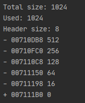
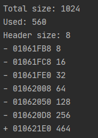
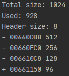
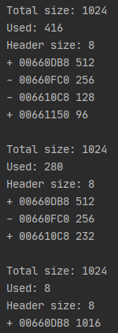
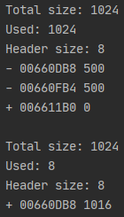
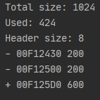
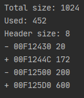
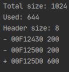
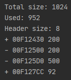

# Lab1: _General-purpose allocator_
The implementation of a general-purpose allocator is based on a doubly-linked list: every block has reference to previous and next blocks.

## Structure
Memory operated by the allocator is divided into blocks. Every block has a header that stores information about this block:
- *is_available* (1 byte) - flag to determine if block is occupied.
- *size* (2 byte) - size of block.
- *prev_size* (2 byte) - size of previous block. Used to refer to previous block.

Due to alignment, the actual size of the header is 8 byte.

## Implementation

When an allocator is created it requests a chunk of memory using the default C++ allocator.
Instead of the default allocator to request an initial block system call *VirtualAlloc* (Windows) or *mmap* (Linux) can be used.
In this implementation, this is not done to make things clear but it can easily be fixed.

`mem_alloc(size_t size)`

Allocate a chunk of memory of size `size`.
If an allocator cannot allocate a block of requested size than nullptr is returned

Allocation is quite simple.
It should be mentioned that allocated memory must be aligned.
In this implementation, each block is 4 byte aligned,
but block alignment *should be determined by your operating system* (for 32-bit is 4 byte and for 64 is 8 byte)
The search method used for finding available block is first fit
(when the first available block is found the search is completed).
When the block is found, it is split into two: one for data and one for future allocations.

`mem_free(void* addr)`

Free allocated block of memory at the address `addr`

Freeing memory is a little bit complicated because we need to be wary of fragmentation and reduce it as much as possible.
To prevent freeing wrong block passed address is validated.
It can prevent some nasty bugs however its complexity is `O(n)`
After releasing the block allocator try to defragment memory by merging neighboring blocks if they are free

`mem_free()`

Free all allocated memory

Simply merge all blocks into one.

`mem_realloc(void* addr, size_t size)`

Reallocate block of memory at address `addr` with new size `size`

Reallocation is quite simple.
First of all, we validate the address in the same way as during `mem_free(void* addr)`.
To reduce some unnecessary operations and not to lose information in the block,
firstly the current block is checked to see if we can do the reallocation in.
If there is no place in the current block even after merging with free neighboring blocks
then allocator tries to allocate memory using `mem_alloc(size_t size)`.

## Examples

#### Allocation example
```
Allocator allocator = Allocator(1024);

allocator.mem_alloc(512);
allocator.mem_alloc(256);
allocator.mem_alloc(128);
allocator.mem_alloc(64);
allocator.mem_alloc(32);
allocator.mem_alloc(16);
allocator.mem_alloc(8);
```


#### Bad allocation example
```
Allocator allocator = Allocator(1024);

allocator.mem_alloc(8);
allocator.mem_alloc(16);
allocator.mem_alloc(32);
allocator.mem_alloc(64);
allocator.mem_alloc(128);
allocator.mem_alloc(256);
allocator.mem_alloc(512);
```


#### Free example
```
Allocator allocator = Allocator(1024);

auto *loc1 = allocator.mem_alloc(512);
auto *loc2 = allocator.mem_alloc(256);
auto *loc3 =  allocator.mem_alloc(128);
```


```
allocator.mem_free(loc1);
allocator.mem_free(loc3);
allocator.mem_free(loc2);
```


#### Free completely example
```
Allocator allocator = Allocator(1024);

allocator.mem_alloc(500);
allocator.mem_alloc(500);

allocator.mem_free();
```


#### Reallocation example
```
Allocator allocator = Allocator(1024);
auto *loc = allocator.mem_alloc(200);
allocator.mem_alloc(200);
```

```
allocator.mem_realloc(loc, 20);
```

```
allocator.mem_realloc(loc, 200);
```

```
allocator.mem_realloc(loc, 500);
```

