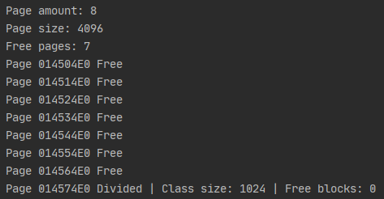
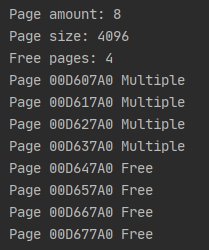
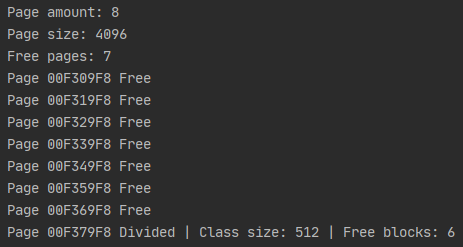
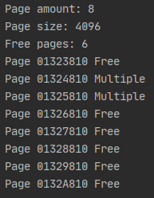
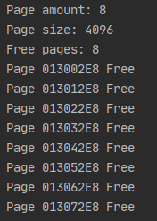
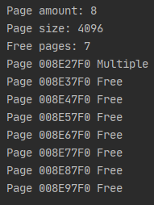

# Lab2: _Page allocator_

## Structure
The memory operated by allocator is divided into pages.
One page can be not equal to size of virtual page. All pages are aligned.
The size of a page in this implementation is _4kb_.

Pages is divided into 2 groups:
- Divided into blocks of the same size
- Used for allocating a block of memory bigger than half of the page

The first group in turn is divided into classes.
A class is determined by the size of the blocks in the page.
The minimum size of the block is 16 bytes.
If block of the memory that should be allocated is not a power of two,
then the size of the block is equal to the next power of two.

When an application request a block of memory bigger than half of the page,
then the whole number of pages is allocated to satisfy request.

Pages can be in one of 3 states:
- _Free_ - page is not occupied
- _Divided_ - page is divided into blocks of the same size
- _MultiplePage_ - page is used to allocate a block of memory bigger than half of the page (2 kb)

Every page has an header to keep track of the page state.
The structure of header:
- _state_ - state of the page
- _size_ - the class size of _Divided_ page or size of multiple pages for _MultiplePage_
- _startPointer_ - pointer to the next free block for _Divided_ page
- _blocks_ - number of free blocks for _Divided_ page or number of pages used for multipage allocation for _MultiplePage_

All headers is store in the dictionary and can be identify by page memory address.
Free pages is stored in the separate list.
Pages divided into blocks with at least 1 free block is stored in the list
which can be gotten from dictionary by class size

## Implementation
When an allocator is created it requests a chunk of memory using the default C++ allocator.
The size of the memory allocated at the start is equal to the number of pages needed to satisfy request.

`mem_alloc(size_t size)`

Allocate a chunk of memory of size `size`.
If an allocator cannot allocate a block of requested size than nullptr is returned

There is 2 work flow for this method:
- when `size` is less than or equal to half of the page
- when `size` is bigger than half of the page

First flow:
1) determine the class of block
2) find the _Divided_ page of the class that has free blocks
3) if page is not found than free page is divided into blocks 
4) allocate block in the page

Second flow:
1) determine the number of pages needed to satisfy request
2) find needed number of free pages
3) allocate block of memory 

`mem_free(void* addr)`

Free allocated block of memory at the address `addr`

This method also has two flows for different groups of pages.

First flow:
1) find the page in which block of memory is located
2) free block of memory
3) assigned `addr` to `startPointer`
4) if all blocks are free change page state to _Free_

Second flow:
1) find the first page of the memory block
2) get the number of pages allocated from `header.blocks`
3) free allocated pages

Freeing memory is a little bit complicated because we need to be wary of fragmentation and reduce it as much as possible.
To prevent freeing wrong block passed address is validated.
It can prevent some nasty bugs however its complexity is `O(n)`
After releasing the block allocator try to defragment memory by merging neighboring blocks if they are free

`mem_free()`

Free all allocated memory

Simply change state of all pages to _Free_.

`mem_realloc(void* addr, size_t size)`

Reallocate block of memory at address `addr` with new size `size`

Reallocation is quite simple.
First of all, allocator try to satisfy request of the new block of memory.
If it can't be satisfied than `nullptr` is returned.
Otherwise move content memory to the new location and call `mem_free(void* addr)` for the old address `addr`. 

## Examples

#### Allocation of the blocks less than half ot the page example
```
PageAllocator allocator = PageAllocator(32 * 1024);
for (int i = 0; i < 4; ++i)
{
    allocator.mem_alloc(1024);
}
```


#### Allocation of the blocks bigger than half ot the page example
```
PageAllocator allocator = PageAllocator(32 * 1024);

allocator.mem_alloc(4 * 1024);
allocator.mem_alloc(3 * 4 * 1024);
```


#### Freeing blocks less than half ot the page example
```
PageAllocator allocator = PageAllocator(32 * 1024);

auto *loc1 = allocator.mem_alloc(512);
allocator.mem_alloc(512);
allocator.mem_alloc(512);
auto *loc3 =  allocator.mem_alloc(512);

allocator.mem_free(loc1);
allocator.mem_free(loc3);
```


#### Freeing blocks bigger than half ot the page example
```
PageAllocator allocator = PageAllocator(32 * 1024);

auto *loc1 = allocator.mem_alloc(512);
allocator.mem_alloc(512);
allocator.mem_alloc(512);
auto *loc3 =  allocator.mem_alloc(512);

allocator.mem_free(loc1);
allocator.mem_free(loc3);
```


#### Freeing whole memory
```
PageAllocator allocator = PageAllocator(32 * 1024);

allocator.mem_alloc(2 * 4 * 1024);
for (int i = 0; i < 4; ++i)
{
    allocator.mem_alloc(1024);
}

allocator.mem_free();
```


#### Reallocation
```
PageAllocator allocator = PageAllocator(32 * 1024);

auto *loc = allocator.mem_alloc(512);
loc = allocator.mem_realloc(loc, 4 * 1024);
```

