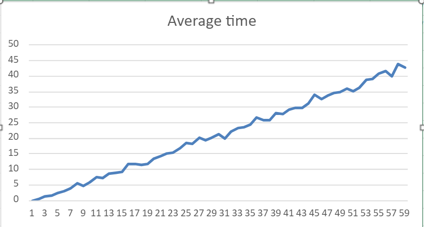
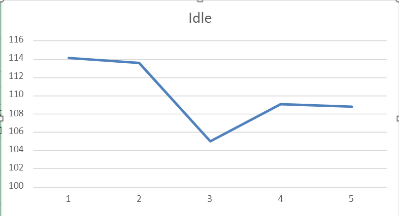
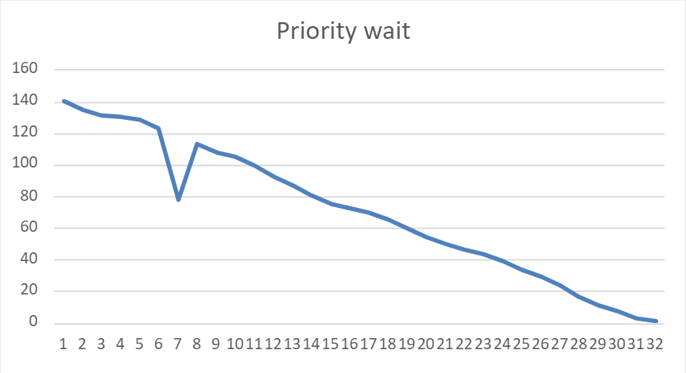

# Lab3: _Process Manager_

## Structure

Request class simulate a process

#### _Request:_
- Id - identifier
- Time - execution time
- Priority - priority of the process
- Delay - delay before continuing process execution 
- WaitTime - time before process starts execution
- Routine - execution routine
- Start - time the process start execution
- End - time the process end execution

## Implementation

Process manager is based on FIFO algorithm (First Input - First Output)
with priorities without replacement

#### Methods

- Add(Request request) - add new request to the queue
- Update(Double dt) - update current request by delta time 

## Benchmarks

