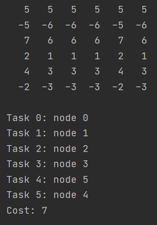

# Lab4: _Dynamic Process Scheduling with realtime constraints_

This is implementation of hungarian algorithm ( also known as the Kuhn–Munkres algorithm or Munkres assignment algorithm).
This algorithm determine the optimal distribution of _N_ tasks for _M_ workers (N <= M)

## Structure

#### _Job:_
- startTime - starting time of job
- endTime - time before which task should be completed
- executeTime - time to complete task

#### _Worker_:
every worker is described by its efficiency, there it is represented by integer from 1 to 10; 

## Implementation

Firstly, we should calculate relative efficiency of workers. For this, divide efficiency of worker by max efficiency.
Next we calculate relative time for job execution by dividing job time by relative efficiency.
And lastly we calculate cost of job execution for every worker. It can be found using formula:\
`startTime - endTime - timeToPrepareWorker - relativeTime`\
After this we have a matrix with the cost of jobs executions. Now using hungarian algorithm we found minimum cost.

Hungarian algorithm:
1. Find minimum value in a row and subtract from every value in a row
2. Find minimum value in a column and subtract from every value in a column
3. Check for optimal solution. Find the minimum number of line needed to cross all zero.
   If number of line zero equal to number of tasks then go to step 5.
4. Find minimum uncovered value in matrix. Subtract it from every uncovered value and add to every value at line crossing
5. Select zero in every row ensuring that each row and column contains only 1 chosen zero.

## Examples

