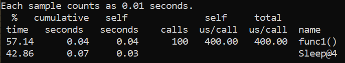
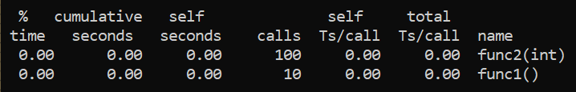
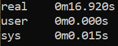
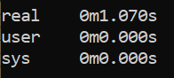

# Lab6: _Profiling_

For profiling C++ source code gprof is used.

To profile C++ you should compile it with the next options:

`gcc source.cpp -g -pg -o output`

After running exe file `gmon.out` will be generated. To get information from it run:

`gprof output.exe gmon.out -p`

Result for example code:

After removing sleep

To measure time of execution:

`time source`

For original sample:

For original sample:

